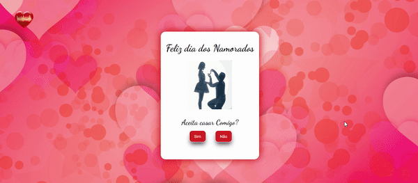
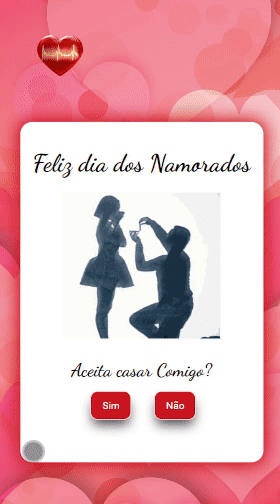

# Dia dos Namorados 

## Resumo

Neste projeto do dia dos namorados temos uma pergunta que é para ser respondida, botão SIM E botão NÃO, para o botão Não tem uma função no JavaScript para não conseguir clicar nele. Botão Sim, e nas  imagens temos outras surpresas como clicar no "body"🎵.

Também foi usado keyframes para uma interface com leves animações (fadeIn e pulse)

# Tecnologias Utilizadas

 
  
	
  

## Veja o funcionamento!
### Desktop

Neste GIF animado, você pode conferir o projeto no Desktop em pleno funcionamento e responsivo.

### Mobile

Neste GIF animado, você pode conferir o projeto no Mobile em pleno funcionamento e responsivo.

## Acesse o Projeto

Você pode acessar o projeto através do link abaixo:

➜ [Link do Projeto](https://ezequiel-lee.github.io/dia-dos-namorados/)

