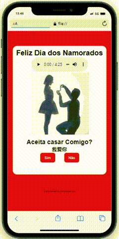
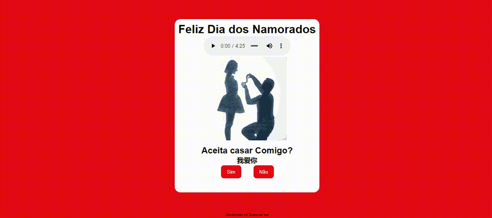

# Dia dos Namorados

## Resumo

Esse literalmente é meu primeiro projeto Responsivo. 
Fiz para celebrar o dia dos namorados e pedir sua pessoa amada em casamento. 
Aprendi em uma aula, e eu modifiquei algumas partes que achei interessante.
Coloquei também uma música de fundo para tocar assim que iniciar a tela, tem navegadores que não vai funcionar, por isso também coloquei na parte de frente do card.
Basicamente são duas perguntas, se ela aceita casar comigo ou não: 
Se Sim, e clicar no botão SIM irá abrir outra página com uma mensagem, clicando no emoji irá abrir uma imagem com o personagem (Feliz).
E se Não; irá clicar no botão NÃO e não conseguirá apertar porque o botão vai fugir para qualquer parte da tela, e se conseguir clicar, irá abrir uma imagem com o personagem (triste)., também existe outra carta com uma declaração escondida.

## Tecnologias Utilizadas

- **HTML**
- **CSS**
- **JavaScript**

(tocar a música automaticamente) Nem todos os Navegadores irá funcionar a função background-music:

## Veja o funcionamento!

Neste GIF animado, você pode conferir o projeto em pleno funcionamento e responsivo.

## Acesse o Projeto

Você pode acessar o projeto através do GitHub Pages. Clique no link abaixo para testar:

➜ [Link do Projeto](https://ezequiel-lee.github.io/dia-dos-namorados/)

